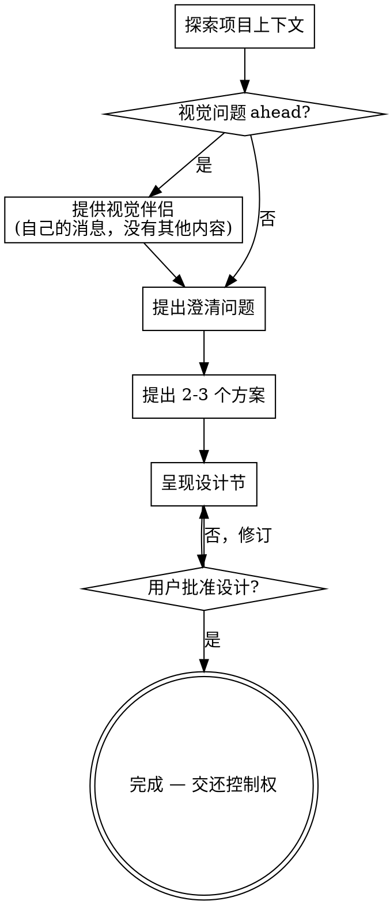

# 将想法头脑风暴为设计

通过自然的协作式对话，帮助将想法转化为完整的设计和规格。

首先了解当前项目上下文，然后一次问一个问题来细化想法。一旦理解了你正在构建的内容，呈现设计并获得用户批准。

<HARD-GATE>
在呈现设计并获得用户批准之前，不要调用任何实现技能、编写任何代码、搭建任何项目或采取任何实施行动。这适用于每个项目，无论其看起来多么简单。
</HARD-GATE>

## 反模式："这太简单了，不需要设计"

每个项目都要经过这个过程。一个待办事项列表、一个单功能工具、一个配置更改——所有这些。"简单"的项目是未经审视的假设导致最多浪费工作的地方。对于真正简单的项目，设计可以很短（几句话），但你必须呈现它并获得批准。

## 检查清单

你必须为以下每个项目创建任务并按顺序完成：

1. **探索项目上下文** — 检查文件、文档、最近提交
2. **提供视觉伴侣**（如果话题将涉及视觉问题）— 这是它自己的消息，不与澄清问题组合。请参阅下面的视觉伴侣部分。
3. **提出澄清问题** — 一次一个，理解目的/约束/成功标准
4. **提出 2-3 个方案** — 包含权衡分析和你推荐的方案
5. **呈现设计** — 按复杂度分节呈现，每节后获得用户批准

> **注意：** 用户批准设计后，这个技能的工作就完成了。不要编写设计文档，不要调用编写计划，不要采取任何实施行动。将控制权交还给调用者，以便他们可以按照项目自己的工作流程继续（例如 `feedback-capture`、`task-dispatcher` 或项目规定的任何流程）。

## 流程图



**终止状态是用户设计批准。** 用户说设计看起来不错后，停止。不要编写设计文档，不要调用编写计划，不要开始编码。将控制权交还给调用者，以便他们可以遵循项目自己的工作流程。

## 流程

**理解想法：**

- 首先检查当前项目状态（文件、文档、最近提交）
- 在提出详细问题之前，评估范围：如果请求描述了多个独立的子系统（例如"构建一个包含聊天、文件存储、计费和分析的平台"），立即标记这一点。不要花时间细化需要首先分解的项目的细节。
- 如果项目对于一个规格来说太大，帮助用户将其分解为子项目：独立的模块有哪些，它们如何关联，应该按什么顺序构建？然后通过正常的设计流程对第一个子项目进行头脑风暴。每个子项目都有自己的规格 → 计划 → 实现周期。
- 对于范围合适的项目，一次问一个问题来细化想法
- 尽可能使用选择题，但开放式也可以
- 每条消息只问一个问题——如果一个话题需要更多探索，将其分成多个问题
- 专注于理解：目的、约束、成功标准

**探索方案：**

- 提出 2-3 个不同的方案，包含权衡分析
- 以对话方式呈现选项，包含你推荐的方案和理由
- 先给出你推荐的选项并解释原因

**呈现设计：**

- 一旦你认为理解了你在构建什么，呈现设计
- 将每个部分按复杂度调整：简单的几句话，复杂的 200-300 字
- 每节后问到目前为止是否看起来正确
- 涵盖：架构、组件、数据流、错误处理、测试
- 如果某些地方没有意义，准备好回溯并澄清

**为隔离和清晰度而设计：**

- 将系统分解为更小的单元，每个单元有一个明确的目的，通过定义良好的接口通信，可以独立理解和测试
- 对于每个单元，你应该能够回答：它做什么，如何使用它，它依赖什么？
- 有人能不读内部代码就理解一个单元做什么吗？你能在不破坏使用者的情况下改变内部实现吗？如果不能，边界需要改进。
- 更小、边界清晰的单元也更容易与你合作——你能更好地在上下文中推理代码，当文件聚焦时你的编辑也更可靠。文件过大通常是它做太多事情的信号。

**在现有代码库中工作：**

- 在提出更改之前探索当前结构。遵循现有模式。
- 当现有代码存在影响工作的问题时（例如文件过大、边界不清晰、职责纠缠），将针对性改进作为设计的一部分——就像一个好的开发者在工作中改进代码一样。
- 不要提出无关的重构。保持专注于当前目标。

## 设计之后

一旦用户批准设计，停止。你的工作到此结束。

- 不要编写设计文档到磁盘。
- 不要调用编写计划或任何其他技能。
- 不要开始编码。

你刚刚与用户达成一致的设计应该在你的自然语言响应中传递回去，以便调用者可以用于后续步骤。

## UI 任务专用 checklist（仅当任务涉及 UI 设计/优化时触发）

> 这部分是 Leader 端的极简检查清单。不展开"为什么"——展开版的设计法则、绝对禁令细则由 implementer 在 `.claude/skills/impeccable` 里按需加载。Leader 只负责问对问题、写对红线，不需要内化整个设计体系。

**触发条件**：任务类型为 `UI 设计-优化` 或 `混合（先功能后优化）`。`功能开发` 任务跳过本 checklist。

### Discovery 4 问（在澄清问题阶段提问，一次一个）

1. **场景句**：用户在什么物理场景下用这个界面？一句话要包含"谁、在哪、什么光线、什么心情"（决定 light/dark + 信息密度）
2. **Color strategy**：选哪一种？
   - `Restrained` — 中性色 + 一抹强调色 ≤10%（产品默认）
   - `Committed` — 一种饱和色占据 30–60% 表面
   - `Full palette` — 3–4 种命名角色色
   - `Drenched` — 整个表面就是这个色
3. **Anchor 参考**：举 2–3 个具体产品/品牌/物件作参考（不接受"现代"、"简洁"这类形容词）
4. **反目标**：这个界面绝对不能像什么？最大的设计错误风险是什么？

### 设计红线 6 条（写进方案规划的"红线约束"段）

回答完 Discovery 4 问后，把以下 6 条原样复制进 `{任务名}_方案规划.md` 第一层契约的"红线约束"中：

```markdown
### 设计红线（impeccable for Compose）
- ❌ 卡片/列表项用左/右彩色 `Modifier.border` 当强调（用整边框、背景色、前缀图标替代）
- ❌ Brush 渐变填充文字（用单色 + Weight/Size 对比做强调）
- ❌ 默认 BlurEffect / 半透明白当装饰
- ❌ "大数字 + 小标签" 的 Hero Metric 卡片模板
- ❌ 同尺寸 Icon+Title+Subtitle 卡片网格阵列
- ❌ 反射性用 ModalBottomSheet/Dialog（先穷尽 inline 展开方案）
```

> Leader 不需要解释这些红线为什么存在。implementer 在执行阶段会通过 `dev-builder` skill 加载 impeccable 的展开版。

## 关键原则

- **一次只问一个问题** — 不要用多个问题压垮用户
- **优先选择题** — 比开放式问题更容易回答
- **无情地 YAGNI** — 从所有设计中移除不必要的功能
- **探索替代方案** — 在确定之前总是提出 2-3 个方案
- **增量验证** — 呈现设计，获得批准后再继续
- **保持灵活** — 当某些地方没有意义时，回溯并澄清

## 视觉伴侣

用于在头脑风暴期间展示模型、图表和视觉选项的基于浏览器的伴侣。作为工具可用——不是模式。接受伴侣意味着它在受益于视觉处理的问题上可用；这不意味着每个问题都通过浏览器进行。

**提供伴侣：** 当你预期即将到来的问题将涉及视觉内容（模型、布局、图表）时，一次性征求同意：
> "我们正在进行的一些工作如果能在网页浏览器中展示给你可能会更容易解释。我可以随时组合模型、图表、对比图和其他视觉内容。这个功能仍然很新，可能会消耗大量 token。想试试吗？（需要打开本地 URL）"

**这个提议必须是它自己的消息。** 不要将其与澄清问题、上下文总结或任何其他内容组合。消息应该只包含上面的提议，别无其他。在继续之前等待用户的回应。如果他们拒绝，继续仅基于文本的头脑风暴。

**逐问题决策：** 即使用户接受了，对每个问题决定是否使用浏览器或终端。测试：**用户通过看比读更能理解这个问题吗？**

- **使用浏览器**用于视觉内容 — 模型、线框图、布局对比、架构图、并排视觉设计
- **使用终端**用于文本内容 — 需求问题、概念选择、权衡列表、A/B/C/D 文本选项、范围决策

关于 UI 话题的问题不自动是视觉问题。"在这个上下文中 personality 是什么意思？"是一个概念问题 — 使用终端。"哪种向导布局更好？"是一个视觉问题 — 使用浏览器。

如果他们同意，在继续之前读取详细指南：
`skills/brainstorming/visual-companion.md`
